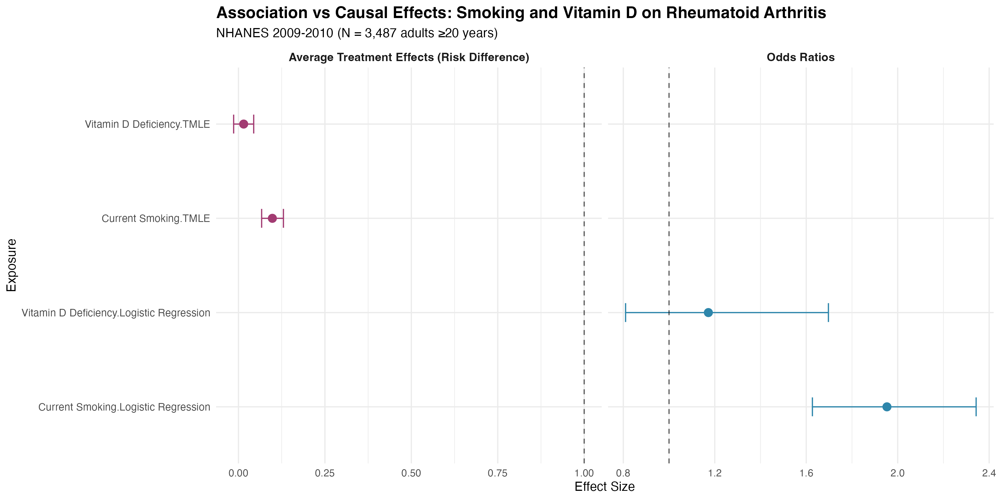
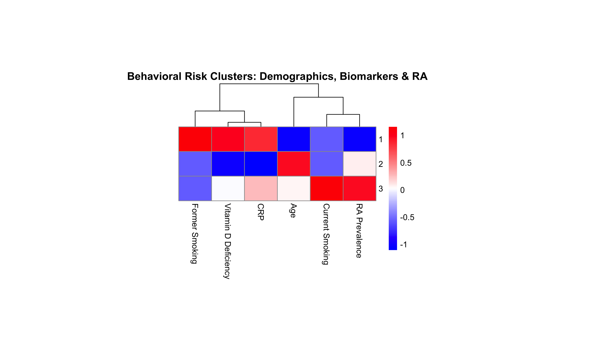
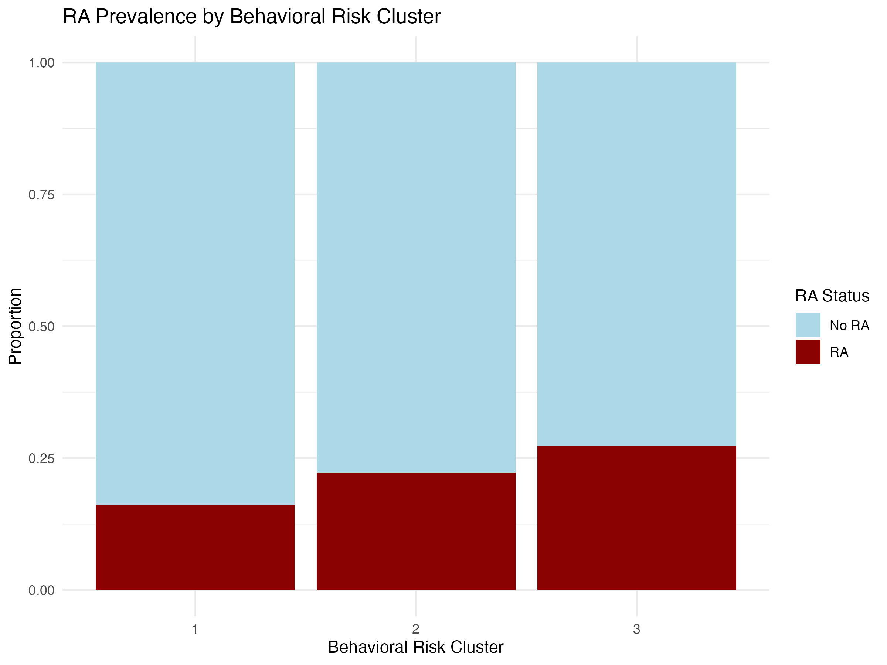

# Causal Effects of Smoking and Vitamin D on Rheumatoid Arthritis Risk

## Overview
Causal inference analysis examining modifiable risk factors for rheumatoid arthritis using NHANES 2009-2010 data (N=4,307). Compares traditional epidemiological associations with causal effect estimates using Targeted Maximum Likelihood Estimation (TMLE).

## Key Findings
- **Smoking**: Strong causal effect (ATE = +9.8 percentage points RA risk, p<0.001)
- **Vitamin D deficiency**: No significant causal effect (ATE = +1.5 percentage points, p=0.30, CI crosses null)
- **Behavioral risk clustering**: Three distinct profiles with RA prevalence ranging from 15% to 28%

## Results

### Forest Plot: Association vs Causal Effects


### Behavioral Risk Clusters




## Methods
- **Population**: 4,307 US adults ≥20 years from NHANES 2009-2010
- **Exposures**: Current smoking, vitamin D deficiency (<50 nmol/L)
- **Outcome**: Doctor-diagnosed rheumatoid arthritis
- **Analysis**: Survey-weighted logistic regression, TMLE for causal inference, behavioral risk clustering

## Repository Structure
```
├── data/
├── clean.r
├── stat.r
├── tmle_fast.r
├── forest_plot.r
├── biomarker.r
├── cleaned_nhanes_f.csv
└── outputs/
```

## Clinical Implications
Results support smoking cessation as a primary RA prevention strategy. Vitamin D supplementation shows no causal benefit for RA prevention, despite observational associations in some studies. Risk stratification identifies high-risk groups for targeted interventions.

## Technical Notes
- Survey weights applied for population representativeness
- TMLE provides double-robust causal estimates
- Behavioral clustering avoids circular biomarker dependencies
- Reproducible with `set.seed(123)`
